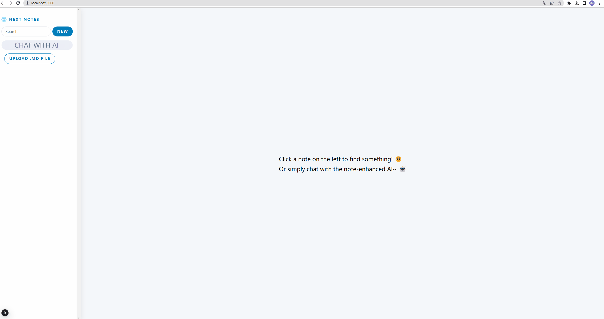
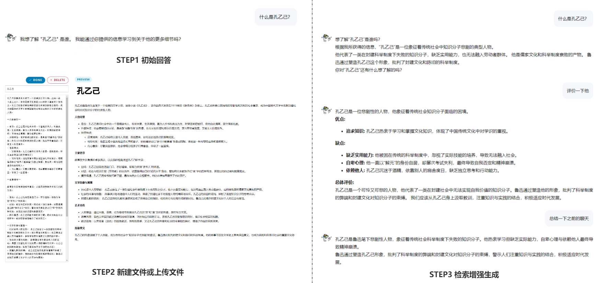

## 简介

Hi👋🏻~，本项目基于 [Next.js](https://nextjs.org) 实现了一个简单的笔记管理系统，能够上传、编辑与预览、删除笔记🗒️。

同时，项目还基于 [LangChain.js](https://js.langchain.com/docs/introduction/) 实现了一个 RAG（检索增强生成）问答机器人🤖，能够基于现有的笔记文档，如公司的内部文档、需求文档等，进行聊天对话。

## 演示
### 功能概览

### 演示分解

如果提问针对的是一些专业性较强的内容甚至是公司的内部文档，由于大语言模型的训练数据集中这方面的知识占比少，模型较大概率会生成一些低质量的回复，这也是 [RAG](https://js.langchain.com/v0.2/docs/tutorials/rag/) 提出的主要原因。例如演示中：
- step1 当允许大模型不回答置信度不高的问题时，提问`什么是孔乙己？`，模型并没有给出明确的答复；
- step2 新建并上传了与`孔乙己`相关的文档信息；
- step3 在拥有额外的知识库后，对于同样的问题，模型给出了正确且关联度高的高质量回复。

## 本地运行
### 环境配置
- 安装项目依赖，如在根目录下执行`npm i`。
- 启动本地大模型，项目使用 [Ollama](https://ollama.com/) 运行谷歌的开源本地大模型 [gemma2](https://blog.google/technology/developers/google-gemma-2/)。安装`Ollama`后，命令行运行`ollama run gemma2`即可。
  - ps：`gemma2`经过测试，正常运行会占用显卡运存`9GB`左右。可以参考 [这里](https://github.com/ollama/ollama) 更换其他更轻量的模型，或直接使用OpenAI提供的接口。
- 启动本地 Redis。
 
### 启动项目
根目录下执行`npm run dev`，在本地开发环境下启动项目。项目运行在`http://localhost:3000`。